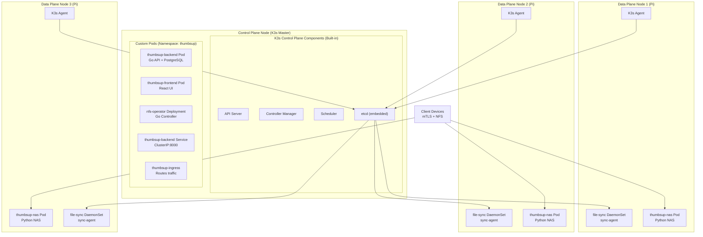

```mermaid
graph TD
    subgraph "Control Plane Node (K3s Master)"
        subgraph "K3s Control Plane Components (Built-in)"
            API[API Server]
            CM["Controller Manager"]
            S[Scheduler]
            ETCD["etcd (embedded)"]
        end
        subgraph "Custom Pods (Namespace: thumbsup)"
            BACKEND["thumbsup-backend Pod<br/>Go API + PostgreSQL"]
            FRONTEND["thumbsup-frontend Pod<br/>React UI"]
            OPERATOR["nfs-operator Deployment<br/>Go Controller"]
            SERVICE["thumbsup-backend Service<br/>ClusterIP:8000"]
            INGRESS["thumbsup-ingress<br/>Routes traffic"]
        end
    end
    
    subgraph "Data Plane Node 1 (Pi)"
        AGENT1["K3s Agent"]
        SYNC1["file-sync DaemonSet<br/>sync-agent"]
        NAS1["thumbsup-nas Pod<br/>Python NAS"]
    end
    
    subgraph "Data Plane Node 2 (Pi)"
        AGENT2["K3s Agent"]
        SYNC2["file-sync DaemonSet<br/>sync-agent"]
        NAS2["thumbsup-nas Pod<br/>Python NAS"]
    end
    
    subgraph "Data Plane Node 3 (Pi)"
        AGENT3["K3s Agent"]
        SYNC3["file-sync DaemonSet<br/>sync-agent"]
        NAS3["thumbsup-nas Pod<br/>Python NAS"]
    end
    
    ETCD --> SYNC1
    ETCD --> SYNC2
    ETCD --> SYNC3
    
    AGENT1 --> ETCD
    AGENT2 --> ETCD
    AGENT3 --> ETCD
    
    CLIENTS["Client Devices<br/>mTLS + NFS"] --> NAS1
    CLIENTS --> NAS2
    CLIENTS --> NAS3
```                       
                                                                      