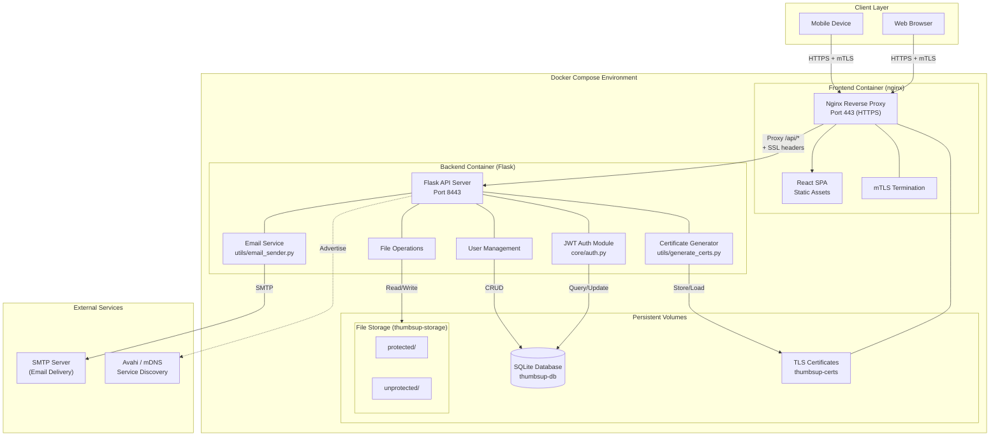
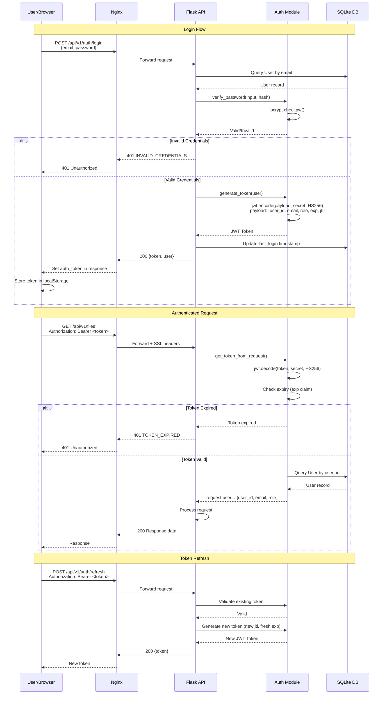
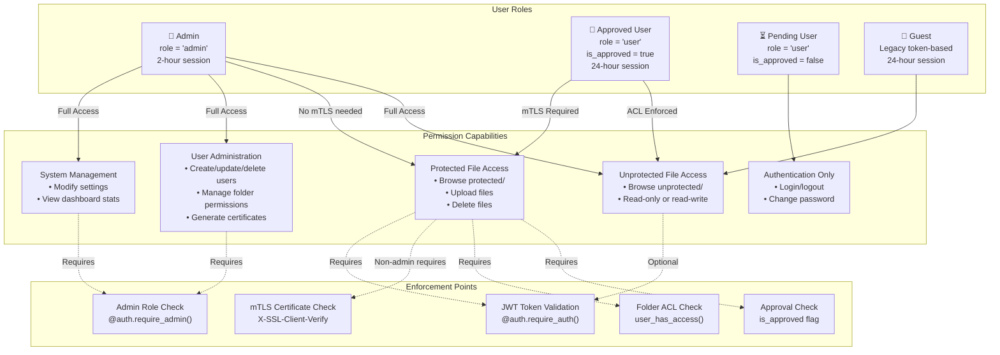
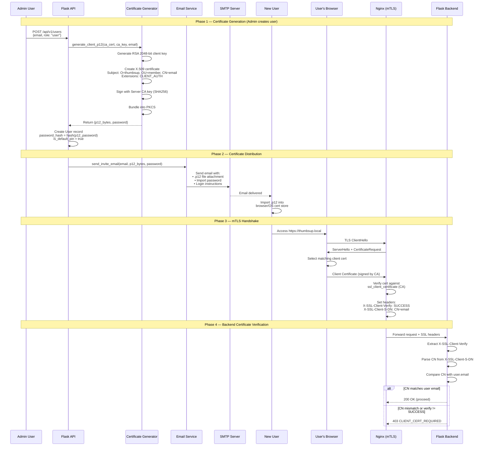
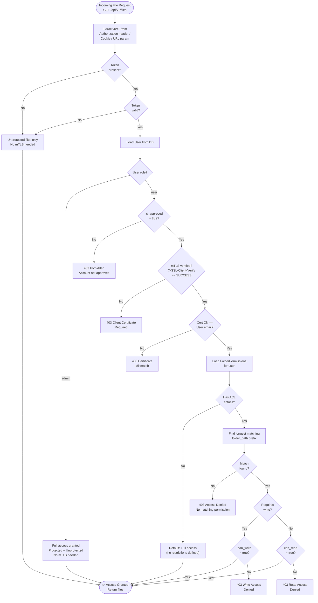
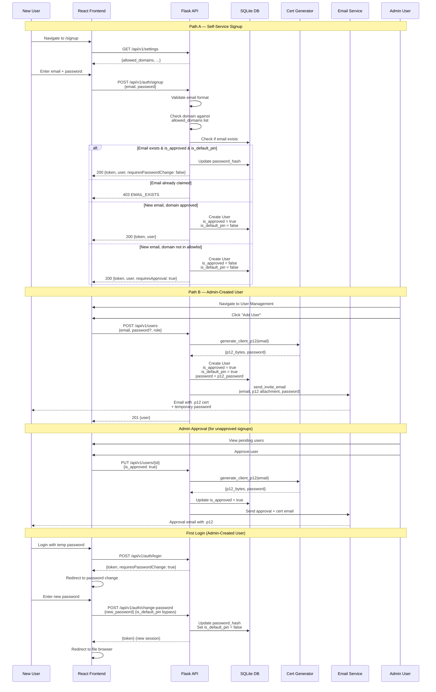
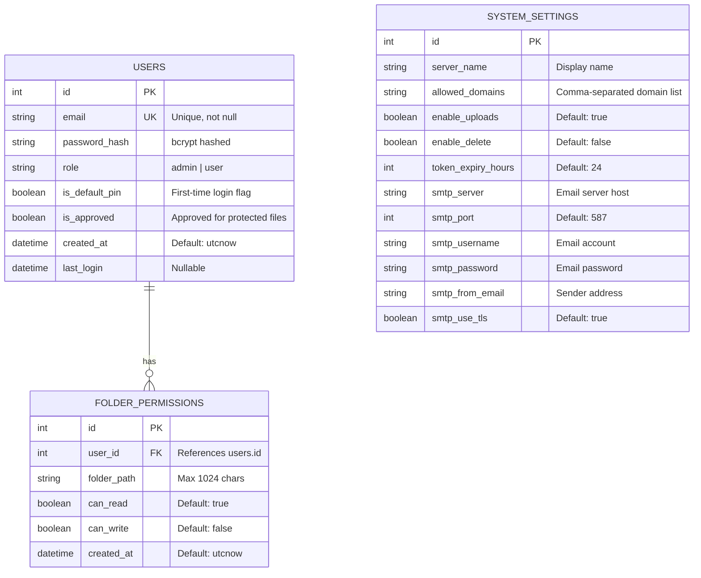

# ThumbsUp System Diagrams

This document contains architectural and flow diagrams describing the critical flows of the ThumbsUp secure file sharing system.

---

## 1. System Architecture Overview

High-level view of the containerized deployment showing how Docker containers, networking, and storage interact.

---

## 2. Authentication Flow

Sequence diagram showing how users authenticate via email/password, receive JWT tokens, and how tokens are validated on subsequent requests.

---

## 3. Role-Based Access Control (RBAC)

Diagram showing the role hierarchy, permissions, and how access control is enforced across the system.

---

## 4. Certificate Lifecycle & mTLS Flow

End-to-end flow of certificate generation, distribution, and mutual TLS authentication.

---

## 5. File Access Control Flow

Decision flow showing how file access requests are evaluated based on user role, approval status, mTLS, and folder ACLs.

---

## 6. User Onboarding & Approval Workflow

Flow showing the complete user lifecycle from signup through approval to first login.

---

## 7. Database Entity Relationship Diagram

Data model showing the relationships between Users, FolderPermissions, and SystemSettings.

---

*Document Version: 1.0*
*Last Updated: March 2026*
*Format: Mermaid (rendered natively by GitHub)*
