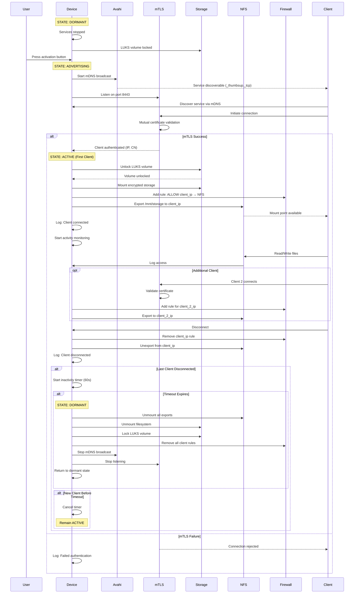
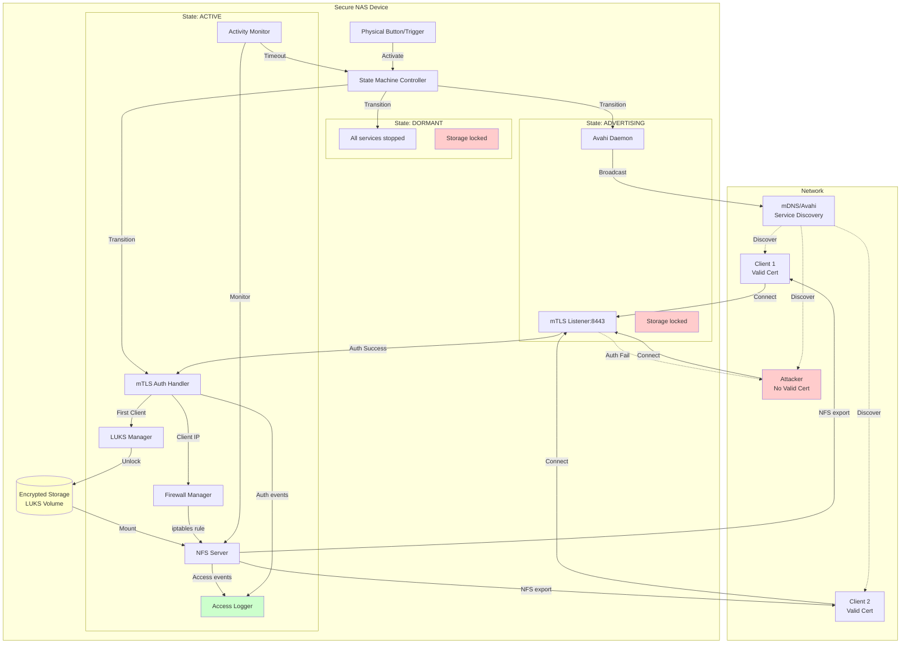
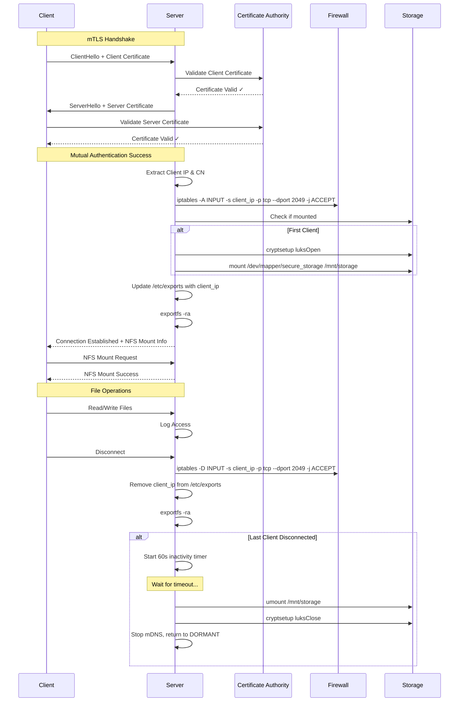
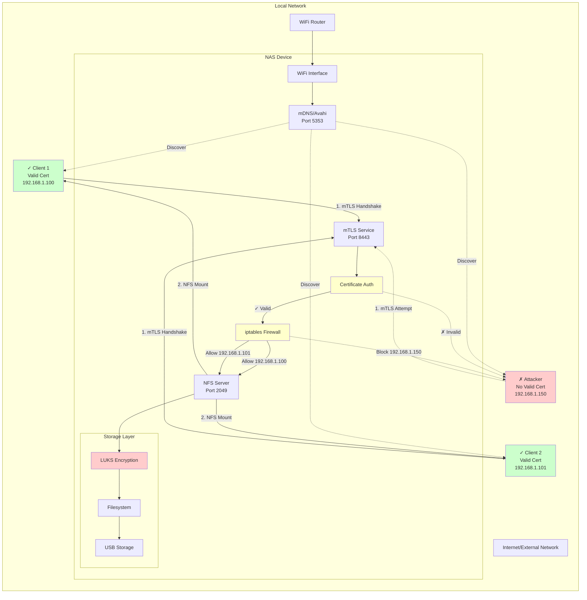

# Secure NAS System Architecture Diagrams

## State Machine Diagram

```mermaid
stateDiagram-v2
    [*] --> DORMANT
    
    state DORMANT {
        [*] --> Idle
        Idle: ❌ No mDNS broadcast
        Idle: ❌ No services listening
        Idle: 🔒 Storage locked (LUKS)
    }
    
    DORMANT --> ADVERTISING: Button Press / Manual Activation
    
    state ADVERTISING {
        [*] --> Waiting
        Waiting: 📡 Avahi broadcasts mDNS
        Waiting: 🔓 mTLS service listening (port 8443)
        Waiting: 🔒 Storage still locked
        Waiting: ⏳ Waiting for authenticated client
    }
    
    ADVERTISING --> ACTIVE: Client connects + mTLS succeeds
    ADVERTISING --> DORMANT: Timeout / No connections
    
    state ACTIVE {
        [*] --> Serving
        Serving: 🔓 LUKS storage unlocked
        Serving: 📂 NFS mounted (client-specific rules)
        Serving: 🛡️ Firewall rules per client IP
        Serving: 📝 Logging all access
        Serving: 👁️ Monitoring activity
        
        state Serving {
            [*] --> SingleClient
            SingleClient --> MultipleClients: Additional client connects
            MultipleClients --> SingleClient: Client disconnects
            SingleClient --> [*]: Last client disconnects
        }
    }
    
    ACTIVE --> ACTIVE: Additional clients connect/disconnect
    ACTIVE --> DORMANT: All clients disconnect + inactivity timeout
    
    state DORMANT {
        Cleanup: 📂 Unmount NFS
        Cleanup: 🔒 Lock storage (LUKS)
        Cleanup: 🛡️ Remove firewall rules
        Cleanup: ❌ Stop mDNS broadcast
    }
    
    DORMANT --> [*]: Device powered off
```

## Sequence Diagram - Full System Interaction



## Component Interaction Diagram



## Authentication Flow Diagram



## Network Security Architecture


