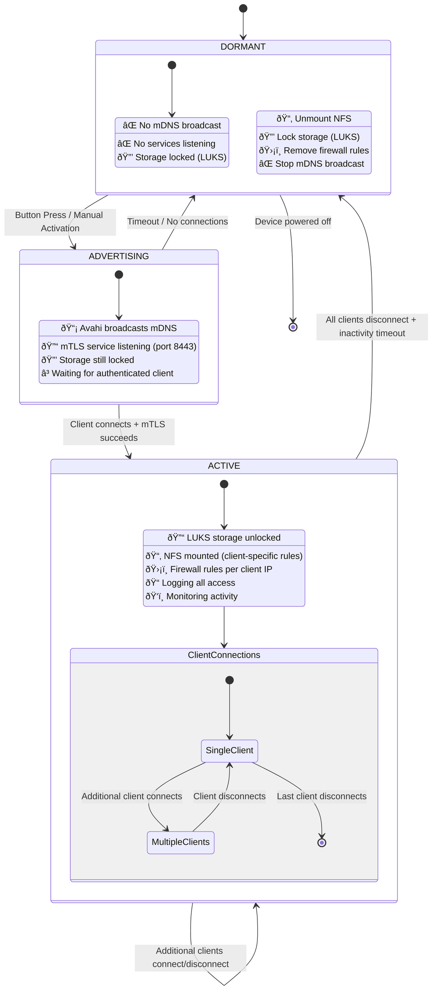
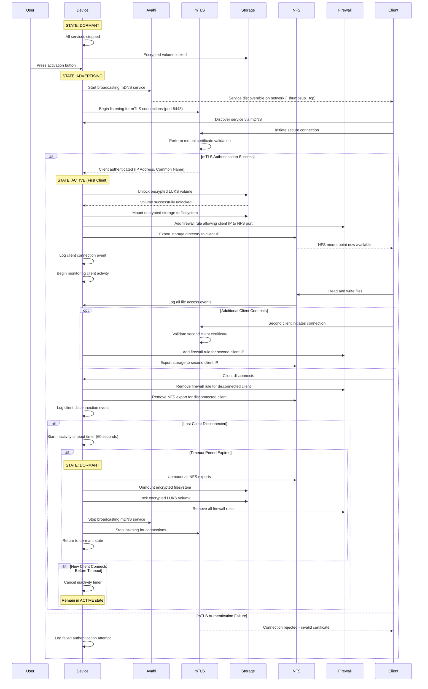
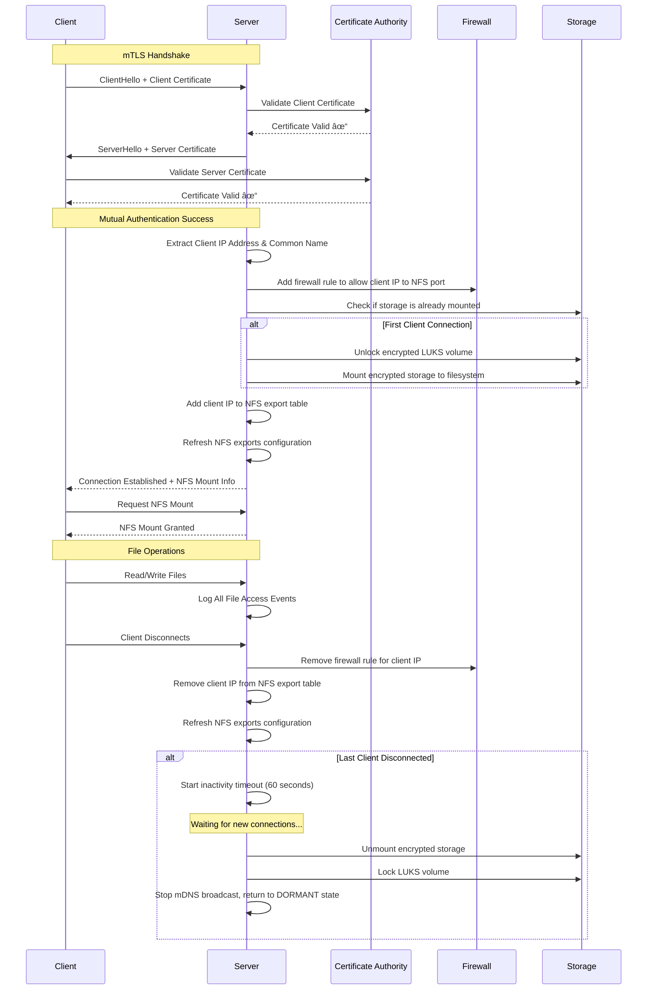

# Secure NAS System Architecture Diagrams

## State Machine Diagram

```mermaid
stateDiagram-v2
    [*] --> DORMANT
    
    state DORMANT {
        [*] --> Idle
        Idle: ⌠No mDNS broadcast
        Idle: ⌠No services listening
        Idle: 🔒 Storage locked (LUKS)
    }
    
    DORMANT --> ADVERTISING: Button Press / Manual Activation
    
    state ADVERTISING {
        [*] --> Waiting
        Waiting: 📡 Avahi broadcasts mDNS
        Waiting: 🔓 mTLS service listening (port 8443)
        Waiting: 🔒 Storage still locked
        Waiting: â³ Waiting for authenticated client
    }
    
    ADVERTISING --> ACTIVE: Client connects + mTLS succeeds
    ADVERTISING --> DORMANT: Timeout / No connections
    
    state ACTIVE {
        [*] --> ActiveState
        ActiveState: 🔓 LUKS storage unlocked
        ActiveState: 📂 NFS mounted (client-specific rules)
        ActiveState: ðŸ›¡ï¸ Firewall rules per client IP
        ActiveState: 📠Logging all access
        ActiveState: ðŸ‘ï¸ Monitoring activity
        
        ActiveState --> ClientConnections
        
        state ClientConnections {
            [*] --> SingleClient
            SingleClient --> MultipleClients: Additional client connects
            MultipleClients --> SingleClient: Client disconnects
            SingleClient --> [*]: Last client disconnects
        }
    }
    
    ACTIVE --> ACTIVE: Additional clients connect/disconnect
    ACTIVE --> DORMANT: All clients disconnect + inactivity timeout
    
    state DORMANT {
        Cleanup: 📂 Unmount NFS
        Cleanup: 🔒 Lock storage (LUKS)
        Cleanup: ðŸ›¡ï¸ Remove firewall rules
        Cleanup: ⌠Stop mDNS broadcast
    }
    
    DORMANT --> [*]: Device powered off
```

## Sequence Diagram - Full System Interaction

```mermaid
sequenceDiagram
    participant User
    participant Device
    participant Avahi
    participant mTLS
    participant Storage
    participant NFS
    participant Firewall
    participant Client
    
    Note over Device: STATE: DORMANT
    Device->>Device: All services stopped
    Device->>Storage: Encrypted volume locked
    
    User->>Device: Press activation button
    
    Note over Device: STATE: ADVERTISING
    Device->>Avahi: Start broadcasting mDNS service
    Avahi-->>Client: Service discoverable on network (_thumbsup._tcp)
    Device->>mTLS: Begin listening for mTLS connections (port 8443)
    
    Client->>Device: Discover service via mDNS
    Client->>mTLS: Initiate secure connection
    
    mTLS->>mTLS: Perform mutual certificate validation
    alt mTLS Authentication Success
        mTLS-->>Device: Client authenticated (IP Address, Common Name)
        
        Note over Device: STATE: ACTIVE (First Client)
        Device->>Storage: Unlock encrypted LUKS volume
        Storage-->>Device: Volume successfully unlocked
        Device->>Storage: Mount encrypted storage to filesystem
        
        Device->>Firewall: Add firewall rule allowing client IP to NFS port
        Device->>NFS: Export storage directory to client IP
        NFS-->>Client: NFS mount point now available
        
        Device->>Device: Log client connection event
        Device->>Device: Begin monitoring client activity
        
        Client->>NFS: Read and write files
        NFS->>Device: Log all file access events
        
        opt Additional Client Connects
            Client->>mTLS: Second client initiates connection
            mTLS->>mTLS: Validate second client certificate
            Device->>Firewall: Add firewall rule for second client IP
            Device->>NFS: Export storage to second client IP
        end
        
        Client->>Device: Client disconnects
        Device->>Firewall: Remove firewall rule for disconnected client
        Device->>NFS: Remove NFS export for disconnected client
        Device->>Device: Log client disconnection event
        
        alt Last Client Disconnected
            Device->>Device: Start inactivity timeout timer (60 seconds)
            
            alt Timeout Period Expires
                Note over Device: STATE: DORMANT
                Device->>NFS: Unmount all NFS exports
                Device->>Storage: Unmount encrypted filesystem
                Device->>Storage: Lock encrypted LUKS volume
                Device->>Firewall: Remove all firewall rules
                Device->>Avahi: Stop broadcasting mDNS service
                Device->>mTLS: Stop listening for connections
                Device->>Device: Return to dormant state
            end
            
            alt New Client Connects Before Timeout
                Device->>Device: Cancel inactivity timer
                Note over Device: Remain in ACTIVE state
            end
        end
        
    else mTLS Authentication Failure
        mTLS-->>Client: Connection rejected - invalid certificate
        Device->>Device: Log failed authentication attempt
    end
```

## Sequence Diagram - Authentication Interaction

```mermaid
sequenceDiagram
    participant C as Client
    participant S as Server
    participant CA as Certificate Authority
    participant FW as Firewall
    participant ST as Storage
    
    Note over C,S: mTLS Handshake
    C->>S: ClientHello + Client Certificate
    S->>CA: Validate Client Certificate
    CA-->>S: Certificate Valid ✓
    S->>C: ServerHello + Server Certificate
    C->>CA: Validate Server Certificate
    CA-->>C: Certificate Valid ✓
    
    Note over C,S: Mutual Authentication Success
    
    S->>S: Extract Client IP Address & Common Name
    S->>FW: Add firewall rule to allow client IP to NFS port
    S->>ST: Check if storage is already mounted
    
    alt First Client Connection
        S->>ST: Unlock encrypted LUKS volume
        S->>ST: Mount encrypted storage to filesystem
    end
    
    S->>S: Add client IP to NFS export table
    S->>S: Refresh NFS exports configuration
    
    S-->>C: Connection Established + NFS Mount Info
    
    C->>S: Request NFS Mount
    S-->>C: NFS Mount Granted
    
    Note over C,S: File Operations
    C->>S: Read/Write Files
    S->>S: Log All File Access Events
    
    C->>S: Client Disconnects
    S->>FW: Remove firewall rule for client IP
    S->>S: Remove client IP from NFS export table
    S->>S: Refresh NFS exports configuration
    
    alt Last Client Disconnected
        S->>S: Start inactivity timeout (60 seconds)
        Note over S: Waiting for new connections...
        S->>ST: Unmount encrypted storage
        S->>ST: Lock LUKS volume
        S->>S: Stop mDNS broadcast, return to DORMANT state
    end
```